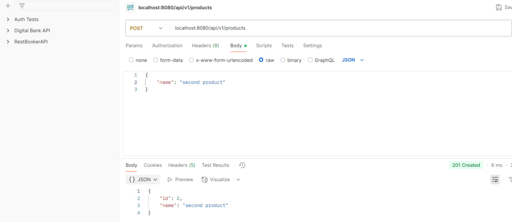
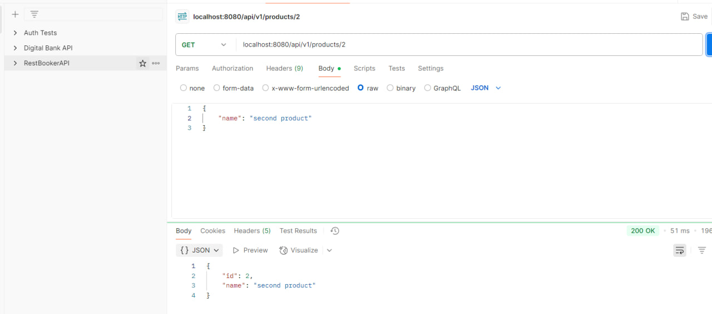
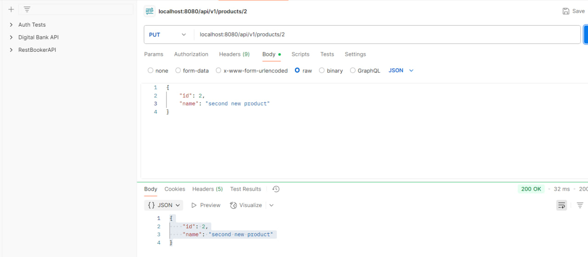
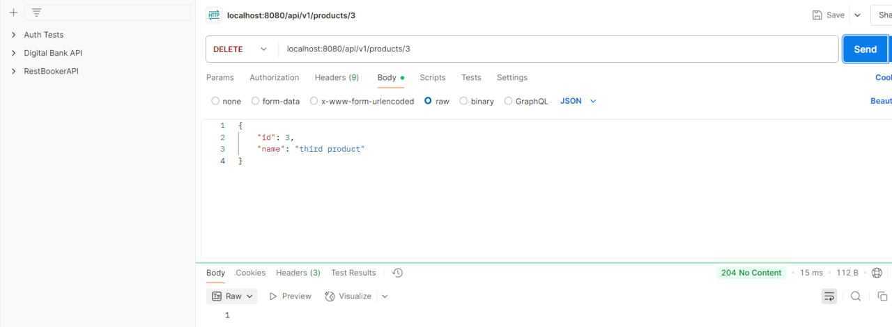
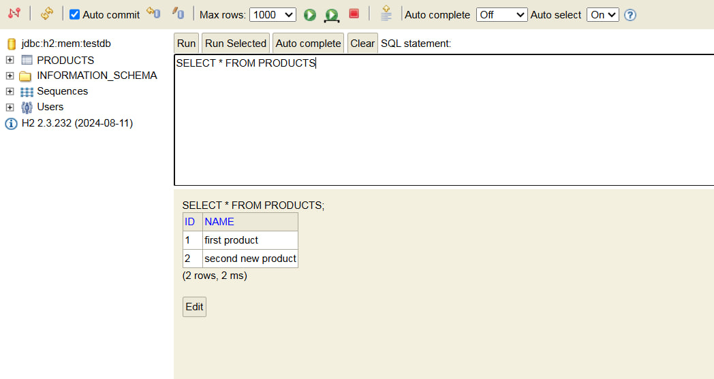

Project name: RestApiApplication (Walter Mangwiro)

Description:

This is a program made using Java and Spring Boot. Think of it as the behind-the-scenes stuff for a website that deals with product info. You can use easy web commands to:
POST request
GET request
PUT request
DELETE request

This is how my application works:

1. To add a new product, send info to /api/v1/products and use POST. Write its name. Then we have to choose JSON in the Body section. We should get "201 created" if its okay
2. To get product's info, use /api/v1/products and GET. If it's there, you get an "200 OK". If not, you get a "404 not found".
3. To change a product, send new info to /api/v1/products and use PUT. Put the new info. Then we have to choose JSON in the Body section. If it's changed, you get an "200 OK". If the product isn't there, you get a "404 not found" message.
4. To delete a product, use /api/v1/products and DELETE. If the product deleted you get "204 no content". If the product is not found, then "404 not found".

Screenshots of my postman and h2 database:

1. POST REQUEST: 
2. GET REQUEST: 
3. PUT REQUEST: 
4. DELETE REQUEST: 
5. H2 database: 
